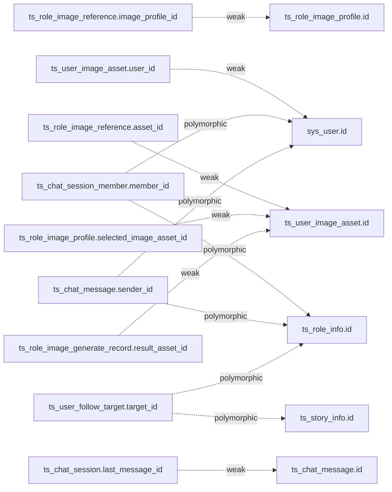

# ai-company 数据库关系图

> 来源：`D:\服务器备份\springboot\local\ai-company.sql`

## 1) 外键关系图（硬关联）

```mermaid
erDiagram
  sys_user ||--o{ ts_role_info : "id -> user_id"
  sys_user ||--o{ ts_user_role_tag : "id -> user_id"
  sys_user ||--o{ ts_role_create_history : "id -> user_id"
  sys_user ||--o{ ts_role_image_generate_record : "id -> user_id"
  sys_user ||--o{ ts_story_info : "id -> user_id/created_by/updated_by"
  sys_user ||--o{ ts_chat_session : "id -> user_id"
  sys_user ||--o{ ts_user_follow_target : "id -> user_id"
  sys_user ||--o{ ts_user_preference_tag : "id -> user_id"
  sys_user ||--|| ts_user_verification : "id -> user_id(unique)"
  sys_user ||--|| ts_user_privacy_setting : "id -> user_id(unique)"
  sys_user ||--o{ ts_user_feedback : "id -> user_id"
  sys_user ||--|| ts_user_voice_config : "id -> user_id(unique)"

  ts_role_info ||--o{ ts_role_create_history : "id -> role_id"
  ts_role_info ||--|| ts_role_image_profile : "id -> role_id(unique)"
  ts_role_info ||--o{ ts_role_image_generate_record : "id -> role_id"
  ts_role_info ||--o{ ts_role_about_item : "id -> role_id"
  ts_role_info ||--|| ts_role_stat : "id -> role_id"
  ts_role_info ||--o{ ts_story_role_rel : "id -> role_id"
  ts_role_info ||--o{ ts_story_chapter : "id -> opening_role_id"
  ts_role_info ||--o{ ts_story_chapter_forbidden_role : "id -> role_id"
  ts_role_info ||--o{ ts_chat_session : "id -> target_role_id"

  ts_role_image_profile ||--o{ ts_role_image_generate_record : "id -> image_profile_id"

  ts_story_info ||--o{ ts_story_role_rel : "id -> story_id"
  ts_story_info ||--|| ts_story_stat : "id -> story_id"
  ts_story_info ||--o{ ts_story_chapter : "id -> story_id"
  ts_story_info ||--o{ ts_story_chapter_forbidden_role : "id -> story_id"
  ts_story_info ||--o{ ts_chat_session : "id -> story_id"

  ts_story_chapter ||--o{ ts_story_chapter_forbidden_role : "id -> chapter_id"

  ts_chat_session ||--o{ ts_chat_session_member : "id -> session_id"
  ts_chat_session ||--o{ ts_chat_message : "id -> session_id"
  ts_chat_message ||--o{ ts_chat_message_attachment : "id -> message_id"
  ts_chat_message ||--o{ ts_chat_message : "id -> reply_to_message_id"

  ts_voice_profile ||--o{ ts_voice_profile_tag : "id -> voice_profile_id"
  ts_voice_tag ||--o{ ts_voice_profile_tag : "id -> tag_id"
  ts_voice_profile ||--o{ ts_user_voice_config : "id -> selected_voice_profile_id"
```

## 2) 业务弱关联（无外键，但接口要联查）

## 3) 接口关联建议（优先级）

## sys_user -> ts_role_info：一对多。一个用户可创建多个角色。
## ts_role_info -> ts_story_role_rel：一对多。一个角色可参与多个故事（通过关系表）。
## ts_story_info -> ts_story_role_rel：一对多。一个故事可绑定多个角色。
## ts_story_info -> ts_story_chapter：一对多。一个故事下有多个章节。
主线链路：sys_user -> ts_role_info -> ts_story_role_rel -> ts_story_info -> ts_story_chapter
- 一级主线：`sys_user -> ts_role_info -> ts_story_role_rel -> ts_story_info -> ts_story_chapter`

## ts_chat_session -> ts_chat_message：一对多。一个会话包含多条消息。
## ts_chat_message -> ts_chat_message_attachment：一对多。一条消息可有多个附件。
## 你当前已加级联删除：删会话会删消息，删消息会删附件。
## 会话链路：ts_chat_session -> ts_chat_message -> ts_chat_message_attachment
- 会话链路：`ts_chat_session -> ts_chat_message -> ts_chat_message_attachment`

## ts_role_info -> ts_role_image_generate_record：一对多。一个角色有多条生成记录。
## ts_role_image_profile：当前是“形象模板表”，与角色不再强绑定（通过 owner_user_id 归属用户/官方）。
## ts_role_image_generate_record.source_profile_url：保存生成时模板图 URL 快照，避免模板删除后无法回显。
## ts_role_image_generate_record.result_asset_id、ts_role_image_profile.selected_image_asset_id：与ts_user_image_asset 是弱关联（记录 ID，不做外键强绑定）。
## 建议链路表达（按你当前结构）：ts_role_image_profile -> ts_role_image_generate_record -> ts_role_info，再按弱关联补 ts_user_image_asset。
- 角色形象链路：`ts_role_info -> ts_role_image_profile -> ts_role_image_generate_record`，再按弱关联补 `ts_user_image_asset`

## ts_voice_profile 和 ts_voice_tag是多对多的关系，中间隔着 ts_voice_profile_tag 关系表，ts_user_voice_config与用户相关。
- 用户配置链路：`sys_user -> ts_user_voice_config -> ts_voice_profile -> ts_voice_profile_tag -> ts_voice_tag`

- 多态字段（`member_id/sender_id/target_id`）建议在接口层统一加 `type + id` 解析器，避免误连

